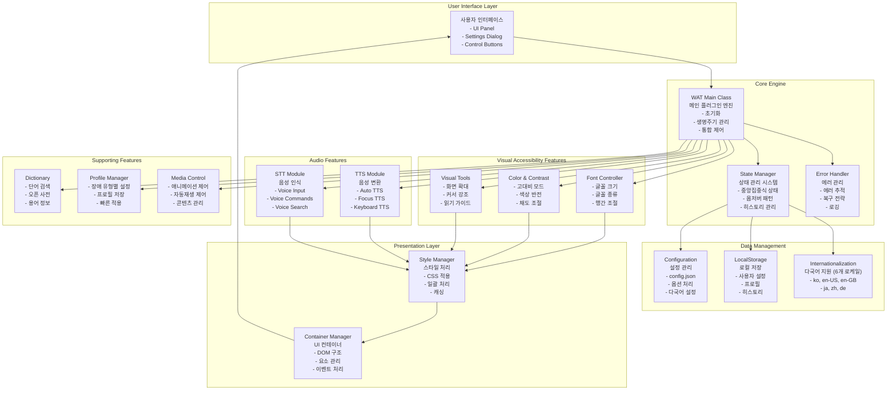
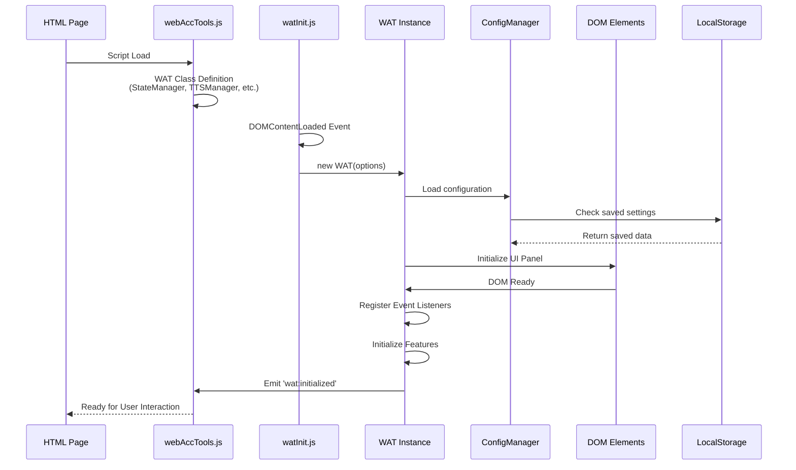
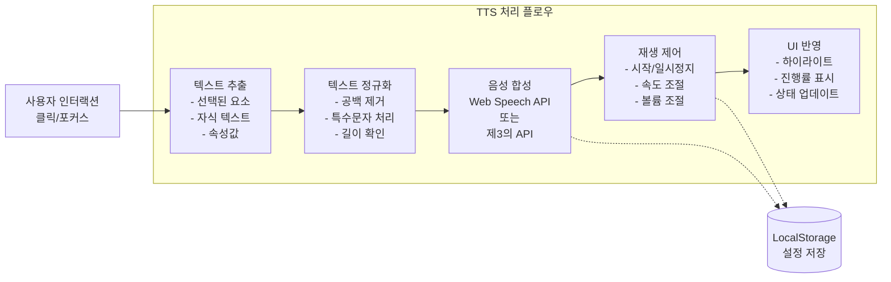
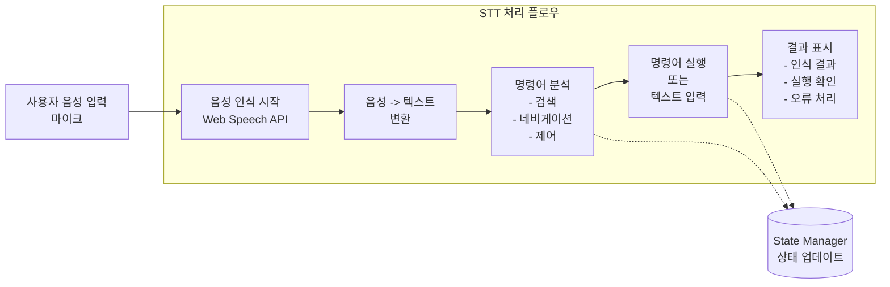
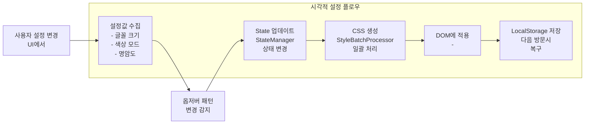
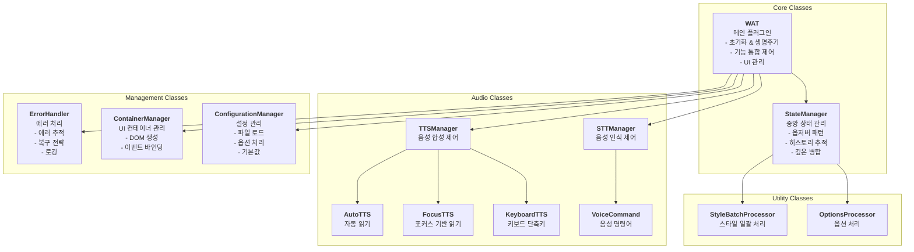
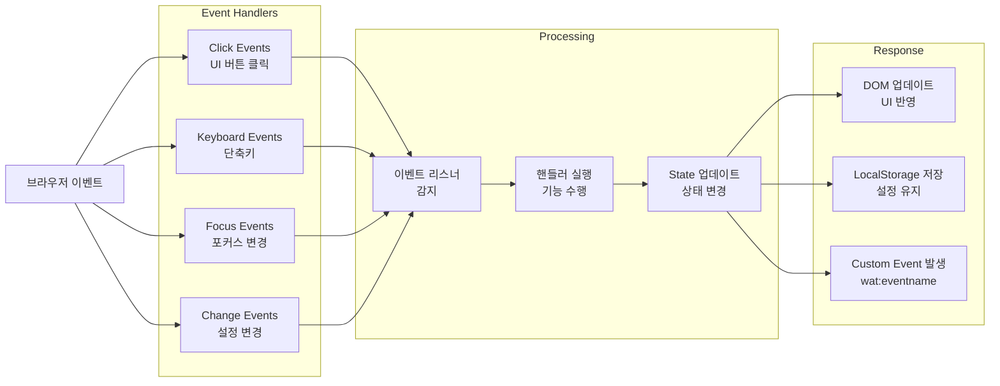

# ModuWeb 아키텍처 및 구성도

## 시스템 전체 구조



---

## 초기화 프로세스



---

## 기능별 프로세스 플로우

### TTS (Text-to-Speech) 프로세스



### STT (Speech-to-Text) 프로세스



### 시각적 설정 적용 프로세스



---

## 🏗️ 클래스 구조 및 역할



---

## 📦 파일 구조

```
ModuWeb/
├── 📄 webAccTools.js (메인 번들)
│   ├── StateManager
│   ├── TTSManager
│   │   ├── AutoTTS
│   │   ├── FocusTTS
│   │   └── KeyboardTTS
│   ├── STTManager
│   │   └── VoiceCommand
│   ├── WAT (메인 클래스)
│   │   ├── ErrorHandler
│   │   ├── ContainerManager
│   │   ├── ConfigurationManager
│   │   ├── StyleBatchProcessor
│   │   └── OptionsProcessor
│   └── Utility Functions
│
├── 📄 watInit.js (초기화 스크립트)
│   └── DOMContentLoaded 핸들러
│
├── 📄 config.json (설정 파일, git 제외)
│   ├── api.dictionary   (사전 JSONP 엔드포인트: enabled/serverEndpoint/timeout)
│   ├── resources.fonts  (외부 폰트 CSS URL)
│   ├── branding         (copyrightUrl)
│   └── settings.ui      (modalWidth, showPronunciation 등)
│
└── 📁 assets/
    ├── 📁 css/
    │   ├── webAccTools.css (메인 스타일)
    │   └── 테마 파일들
    ├── 📁 fonts/
    │   └── 접근성 폰트들
    ├── 📁 images/
    │   └── UI 아이콘들
    └── 📁 locales/
        ├── ko.json (한국어)
        ├── en-US.json (영어 - 미국)
        ├── en-GB.json (영어 - 영국)
        ├── ja.json (일본어)
        ├── zh.json (중국어)
        └── de.json (독일어)
```

> **참고**: 로케일 파일은 위 6개(`ko`, `en-US`, `en-GB`, `ja`, `zh`, `de`)이며 `en.json`은 존재하지 않습니다. `assets/js/` 폴더도 없습니다. `config.json`은 다국어 UI 텍스트나 API 키를 담지 않으며(사전은 서버 측 JSONP 중계로 처리), 다국어 문자열은 `assets/locales/*.json`에서 로드됩니다.

---

## 📂 소스 모듈 레이아웃 (`src/`)

배포 번들(`dist/webAccTools.js`)은 Rollup으로 아래 **19개 소스 파일**을 묶어 생성합니다.
(자세한 빌드 절차는 [`CONTRIBUTING.md`](./CONTRIBUTING.md) 참고)

```
src/
├── index.js                        # 진입점 / named exports (WAT, ErrorHandler, StateManager, TTSManager, STTManager) + window.WAT 등록
├── wat/
│   ├── WAT.js                      # 메인 클래스 (약 10,800줄 단일 파일)
│   └── StateManager.js             # 중앙 상태 관리 (옵저버 패턴)
├── core/                           # 9개 파일
│   ├── ConfigurationManager.js     # config.json 로드 · 옵션 처리
│   ├── OptionsProcessor.js         # 비율/언어/컨테이너/스타일/선택자 옵션 정규화
│   ├── ContainerManager.js         # UI 컨테이너 DOM 관리
│   ├── StyleBatchProcessor.js      # 스타일 일괄 처리
│   ├── ErrorHandler.js             # 중앙집중식 에러 처리
│   ├── constants.js                # 상수(STORAGE_KEYS 등)
│   ├── defaults.js                 # 기본 설정값
│   ├── localization.js             # SUPPORTED_LANGUAGES · 로케일 파일 매핑
│   └── validation.js               # 입력 검증 유틸
├── tts/                            # 5개 파일
│   ├── TTSManager.js               # TTS 총괄 (toggleAutoTTS / toggleFocusTTS)
│   ├── BaseTTS.js                  # TTS 공통 로직
│   ├── AutoTTS.js                  # 자동 읽기
│   ├── FocusTTS.js                 # 포커스 기반 읽기
│   └── KeyboardTTS.js              # 키보드 단축키 읽기
└── stt/                            # 2개 파일
    ├── STTManager.js               # STT 총괄 (toggleVoiceCommand)
    └── VoiceCommand.js             # 음성 명령어 해석·실행
```

| 디렉터리 | 파일 수 | 역할 |
|----------|:-----:|------|
| `wat/` | 2 | 메인 클래스 + 상태 관리 |
| `core/` | 9 | 설정·옵션·컨테이너·스타일·에러·상수·검증 |
| `tts/` | 5 | 음성 합성(TTS) 매니저 및 모드 |
| `stt/` | 2 | 음성 인식(STT) 매니저 및 명령 |
| `index.js` | 1 | 진입점 / 공개 export |
| **합계** | **19** | |

> **진행 중인 리팩터링**: `src/wat/WAT.js`는 약 **10,800줄**에 달하는 단일 파일로, 위 매니저 클래스(TTSManager/STTManager/ConfigurationManager/ContainerManager 등)로 책임을 점진적으로 분해하는 작업이 진행 중입니다. 위 다이어그램의 클래스 관계는 이 목표 구조를 기준으로 그려졌으며, 일부 로직은 아직 `WAT.js` 내부에 남아 있습니다.

---

## 🔌 이벤트 흐름



---

## 🚀 주요 특징

| 계층 | 역할 | 핵심 기술 |
|------|------|---------|
| **UI Layer** | 사용자 인터페이스 | HTML/CSS, 동적 DOM 조작 |
| **Core Engine** | 통합 제어 & 상태관리 | StateManager, 옵저버 패턴 |
| **Feature Layer** | 접근성 기능 구현 | TTS, STT, 시각적 조정 |
| **Data Layer** | 설정 & 저장소 | LocalStorage, JSON 설정 |
| **Utility Layer** | 보조 기능 | CSS 처리, 에러 관리 |

---

## ⚡ 주요 프로세스

1. **초기화 프로세스**: HTML 로드 → Script 로드 → DOMContentLoaded → WAT 초기화 → 설정 로드 → UI 생성 → Ready
2. **TTS 프로세스**: 사용자 클릭 → 텍스트 추출 → 음성 합성 → 재생 & UI 반영 → 상태 저장
3. **시각적 설정**: 사용자 입력 → State 업데이트 → CSS 생성 → DOM 적용 → 저장
4. **에러 처리**: 에러 발생 → ErrorHandler 감지 → 복구 전략 실행 → 사용자에게 안내

---

## 🔐 데이터 흐름

```
사용자 입력
    ↓
Event Handler
    ↓
StateManager.set()
    ↓
옵저버 알림
    ↓
Feature Module (TTS, 시각조정 등)
    ↓
StyleBatchProcessor / UI Update
    ↓
DOM 반영
    ↓
LocalStorage 저장
    ↓
다음 방문시 복구
```

---

이 문서는 WAT의 주요 모듈 관계와 처리 흐름을 한눈에 정리한 것입니다.
