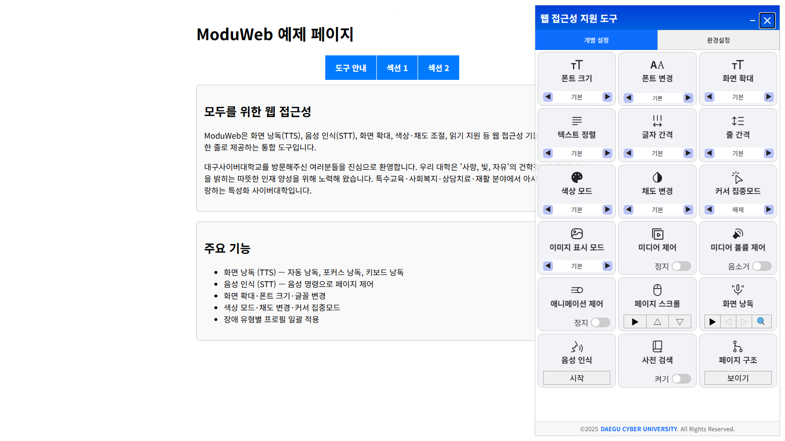
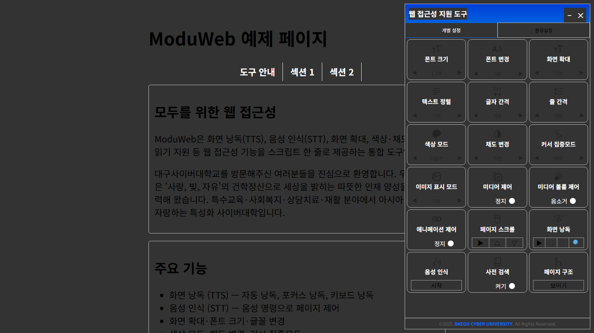
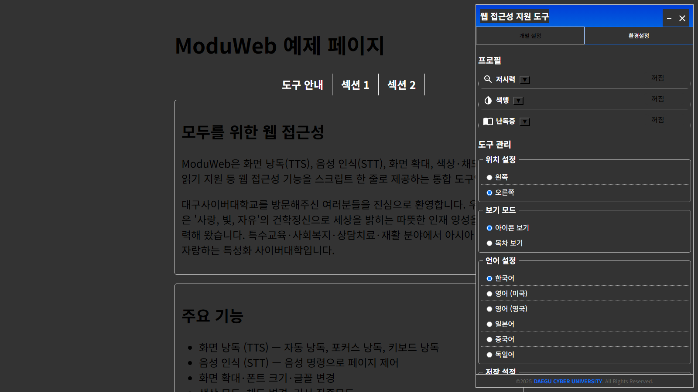

# ModuWeb (Web Accessibility Tools)

[](LICENSE)
[](https://github.com/Daegu-Cyber-University/ModuWeb/releases)
[](https://github.com/Daegu-Cyber-University/ModuWeb/actions/workflows/ci.yml)
[](https://www.jsdelivr.com/package/gh/Daegu-Cyber-University/ModuWeb)
[](https://github.com/Daegu-Cyber-University/ModuWeb/stargazers)

> 모두를 위한 웹 - 웹 접근성 향상을 위한 통합 도구
>
> **ModuWeb** is a drop-in web accessibility widget for any website — screen reader (TTS), voice commands (STT), magnification, color adjustment, and an offline-ready single-file bundle. WCAG 2.1 AA · KWCAG 2.1 compliant. — **[English README](README.en.md)**

**🔗 라이브 데모 (Live Demo): <https://daegu-cyber-university.github.io/ModuWeb/>**

[](https://daegu-cyber-university.github.io/ModuWeb/)

| 다크 모드 + 폰트 1.5배 적용 | 장애 유형별 프로필 설정 |
|---|---|
|  |  |

---

### 🧭 어디부터 보면 되나요?

| 나는… | 이렇게 하세요 |
|---|---|
| **내 웹사이트에 그냥 적용하고 싶은 사용자** | 아래 [빠른 시작](#빠른-시작)의 방법 1~3 중 하나를 복붙하면 끝. 코딩·빌드 불필요. |
| **배포 파일 하나로 받아서 쓰고 싶은 사용자** | 배포 zip(`moduweb-<버전>.zip`)의 압축을 풀고 `install-guide.html`을 여세요. → [배포 패키지](#배포-패키지-완성본-zip) |
| **소스를 고쳐서 쓰고 싶은 개발자** | [개발자 가이드 — 수정하고 다시 배포하기](#개발자-가이드--수정하고-다시-배포하기)를 보세요. |

> **빌드가 필요한가요?** 아니요. `dist/`에 빌드 완성본이 이미 들어 있어 **일반 사용자는 빌드하지 않습니다.**
> 빌드는 **소스(`src/`)를 수정한 개발자만** `dist/`를 다시 만들 때 실행합니다.

---

## 목차

- [소개](#소개)
- [주요 기능](#주요-기능)
- [빠른 시작](#빠른-시작)
- [배포 패키지 (완성본 zip)](#배포-패키지-완성본-zip)
- [개발자 가이드 — 수정하고 다시 배포하기](#개발자-가이드--수정하고-다시-배포하기)
- [로컬 개발 환경 설정](#로컬-개발-환경-설정)
- [사용법](#사용법)
- [설정 옵션](#설정-옵션)
- [API 문서](#api-문서)
- [예제](#예제)
- [브라우저 지원](#브라우저-지원)
- [라이선스](#라이선스)
- [지원](#지원)

## 소개

**ModuWeb (Web Accessibility Tools)**은 웹 접근성 향상을 돕는 JavaScript 라이브러리입니다.

### 주요 특징

- 간편한 통합: 단 몇 줄의 코드로 웹사이트에 접근성 기능을 추가합니다.
- 다국어 지원: 한국어, 영어, 일본어, 중국어, 독일어 지원
- 반응형 설계: 데스크톱과 모바일 모두 지원
- WCAG 2.1 AA 준수: 국제 웹 접근성 표준을 지향합니다.
- 커스터마이징 가능: 다양한 테마와 설정 옵션
- 기능: TTS, STT, 화면 확대, 색상 조절 등

사이트 접근성 개선을 적용하는 데 필요한 기능을 제공합니다.

## 주요 기능

### 시각적 접근성
- **글꼴 조절**: 텍스트 크기 및 폰트 종류를 조절
- **텍스트 정렬**: 텍스트 좌우 정렬 및 간격 조절
- **저시력 지원**: 화면 전체 크기 조절

### 색상 인식 지원
- **색상 모드**: 기본·밝게·어둡게·반전 4종 (첫 방문 시 OS 다크 모드 설정 자동 반영)
- **채도 조절**: 채도 및 명암 조절
- **색약 보정**: 적색약·녹색약 보정 필터

### 집중력 지원
- **커서 도구**: 마우스 위치 강조
- **읽기 지원**: 웹페이지 콘텐츠 읽기를 위한 집중력 지원
- **미디어 제어**: 미디어 콘텐츠 및 애니메이션 제어

### 청각적 접근성
- **TTS (Text-to-Speech)**: 텍스트를 음성으로 변환 (환경설정에서 낭독 음성 선택 가능)
- **STT (Speech-to-Text)**: 음성을 텍스트로 변환

### 보조 지원도구
- **사전 기능**: 오픈 사전 검색 지원
- **읽기 모드**: 집중 읽기를 위한 단순화된 화면
- **페이지 구조 탐색**: 제목·랜드마크·링크 목록으로 페이지 개요 확인과 위치 이동
- **다국어 지원**: 한국어, 영어, 일본어, 중국어 지원

### 키보드 접근성
- **키보드 내비게이션**: 마우스 없이 모든 기능 접근 가능
- **포커스 표시기**: 현재 포커스된 요소 강조 표시
- **단축키**: `Alt+Shift+T`(선택 영역 낭독) / `Alt+Shift+D`(사전 검색) / `Alt+Shift+S`(음성 명령). `settings.ui.keyboardShortcuts: false`로 비활성화 가능

### 설정 관리
- **프로필 기능**: 장애 유형별 프로필 일괄 적용
- **설정 저장**: 도구 사용성 지원을 위한 설정 저장

## 빠른 시작

빌드 도구나 서버 설정 없이 아래 세 가지 방법 중 하나로 바로 사용할 수 있습니다.

### 방법 1 — CDN 한 줄 설치 (가장 간단)

HTML에 script 태그 한 줄만 추가하면 됩니다. CSS·아이콘·언어 파일이 자동으로 로드됩니다.

```html
<script src="https://cdn.jsdelivr.net/gh/Daegu-Cyber-University/ModuWeb@main/dist/webAccTools.js" data-wat-auto></script>
```

특정 버전으로 고정하려면 `@main` 대신 릴리스 태그(예: `@v2.1.0`)를 사용하세요.

`data-wat-*` 속성으로 초기화 코드 없이 설정할 수 있습니다.

```html
<script src=".../dist/webAccTools.js" data-wat-auto
	data-wat-language="ko"
	data-wat-config='{"branding": {"copyrightUrl": "https://example.com"}}'></script>
```

| 속성 | 설명 |
|---|---|
| `data-wat-auto` | 자동 초기화 활성화 (필수 스위치) |
| `data-wat-config` | config.json 경로(스크립트 위치 기준) 또는 인라인 JSON(`{`로 시작) |
| `data-wat-language` | 기본 언어 (`ko`, `en-US`, `en-GB`, `ja`, `zh`, `de`) |
| `data-wat-container` | 컨테이너 CSS 셀렉터 |
| `data-wat-inject-css` | `"false"`면 CSS 자동 주입 끄기 (직접 `<link>` 관리 시) |

### 방법 2 — 단일 파일 복사 (오프라인·폐쇄망 지원)

`dist/webAccTools.standalone.min.js` **파일 하나만** 웹 서버에 복사하면 됩니다.
CSS·아이콘·한국어 언어 데이터가 파일 안에 모두 포함되어 있어 assets 폴더, 설정 파일, 외부 네트워크가 전혀 필요 없습니다.

```html
<script src="/path/to/webAccTools.standalone.min.js" data-wat-auto></script>
```

> 한국어 외 언어(en-US 등)를 쓰려면 `assets/locales/` 폴더도 함께 배포하세요 (한국어는 내장).

### 방법 3 — 폴더 다운로드 (자체 서버에 두고 사용)

1. [릴리스 페이지](https://github.com/Daegu-Cyber-University/ModuWeb/releases)에서 zip 다운로드
2. `dist/` 폴더를 **구조 그대로** 웹 서버에 복사 (JS가 `assets/` 하위의 CSS·아이콘·언어 파일을 상대 경로로 찾습니다)
3. HTML에 한 줄 추가

```html
<script src="/path/to/dist/webAccTools.js" data-wat-auto></script>
```

> 빌드는 필요 없습니다 — `dist/`에 빌드된 파일이 이미 포함되어 있습니다.

### 방법 4 — 직접 초기화 (세밀한 제어가 필요할 때)

```html
<link rel="stylesheet" href="path/to/dist/assets/css/webAccTools.css">
<script src="path/to/dist/webAccTools.js"></script>
<script>
	document.addEventListener('DOMContentLoaded', () => {
		const wat = new WAT({
			configPath: './config.json',   // 또는 config: { ... } 인라인 객체
		});
		window.watPlugin = wat;
		wat.init();
	});
</script>
```

`config` 옵션에 객체를 직접 넘기면 config.json 파일 없이도 동작합니다. 사전 검색 기능만 별도 서버 설정([설정 옵션](#설정-옵션) 참고)이 필요하고, 나머지 기능은 설정 없이 모두 동작합니다.

## 배포 패키지 (완성본 zip)

기관·사용자에게 **파일 하나로 전달**하고 싶을 때 사용하는, 압축만 풀면 바로 쓰는 배포본입니다.

**받는 사람 입장 (빌드·개발 지식 불필요):**

1. `moduweb-<버전>.zip` 압축을 풉니다.
2. `install-guide.html`을 브라우저로 엽니다. (복붙용 설치 안내)
3. 안내대로 `webAccTools.standalone.min.js` 파일 1개를 웹사이트에 올리고 `<script … data-wat-auto>` 한 줄을 넣으면 끝.

**압축 안 구성:**

| 항목 | 용도 |
|---|---|
| `webAccTools.standalone.min.js` | **단일 파일** — 이것 하나 + 1줄이면 설치 완료 (한국어 내장, 오프라인 동작) |
| `dist/` | 폴더 방식·다국어용 (CSS·아이콘·언어·폰트 포함) |
| `install-guide.html` | 일반 사용자용 설치 안내 (먼저 여는 파일) |
| `example.html` | 그대로 열어보는 동작 예제 |
| `README.md` | 개발자용 상세 문서 |

**패키지 만들기 (관리자/개발자):**

```bash
npm run package        # 빌드까지 새로 하고 zip 생성 (권장)
# 또는
npm run package:only   # 현재 dist/ 로 zip 만 생성
```

결과물은 `package-build/moduweb-<버전>.zip` 에 생성됩니다. (git에는 포함되지 않음 — GitHub [릴리스](https://github.com/Daegu-Cyber-University/ModuWeb/releases)에 첨부해 배포)

## 개발자 가이드 — 수정하고 다시 배포하기

소스를 고쳐서 쓰려는 개발자를 위한 요약입니다. (환경 구성 세부는 아래 [로컬 개발 환경 설정](#로컬-개발-환경-설정)과 [`CONTRIBUTING.md`](./CONTRIBUTING.md) 참고)

**핵심 원칙:** 사용자에게 나가는 산출물은 `dist/`입니다. `dist/`는 **직접 손대지 말고**, `src/`(및 CSS 원본)를 고친 뒤 **빌드로 다시 생성**하세요.

**소스 구조:**

| 위치 | 내용 |
|---|---|
| `src/wat/WAT.js` | 메인 클래스 (오케스트레이션) |
| `src/wat/*.js` | 기능 모듈 — `PanelBuilder`(설정 패널 UI), `SettingsApplier`(설정 저장/프로필), `OverlayManager`(모달), `Dictionary`, `PageStructure`, `IframeStyler`, `StateManager` |
| `src/tts/`, `src/stt/` | 음성 읽기(TTS)·음성 명령(STT) |
| `src/core/` | 공통(상수·기본값·로케일·설정 관리·유틸) |
| `dist/assets/css/webAccTools.css` | **스타일 원본** (여기서 직접 편집 — 빌드가 이 파일을 standalone에 인라인함) |
| `dist/assets/locales/*.json` | 언어 파일 |

**수정 → 배포 루프:**

```bash
npm install            # 최초 1회
# … src/ 또는 CSS 수정 …
npm test               # 단위/특성화 테스트 (동작 회귀 방지)
npm run lint           # 코드 규칙
npm run lint:css       # CSS 셀렉터 누수 게이트
npm run build          # dist/webAccTools.js · *.min.js · *.standalone.min.js 재생성
npm run package        # (선택) 배포 zip 생성
```

- **CSS만 고칠 때도** `npm run build`를 실행해야 standalone 번들의 인라인 CSS가 갱신됩니다.
- 커밋 시 `src/` 변경과 함께 재생성된 `dist/`를 **같이 커밋**하세요 (사용자는 `dist/`를 바로 가져다 씁니다).
- 새 사용자 노출 문자열은 하드코딩하지 말고 `dist/assets/locales/*.json`에 키로 추가하세요 (다국어·`locale-parity` 테스트 유지).

### Git Clone (개발 참여용)

```bash
git clone https://github.com/Daegu-Cyber-University/ModuWeb.git
cd ModuWeb
```

## 로컬 개발 환경 설정

저장소를 클론한 후 아래 단계를 따라 로컬 환경을 구성하세요.

> **한눈에**: 설정 원천은 `.env` **파일 하나**입니다. `.env`를 채우면 `npm run build`(또는 `npm run config:from-env`)가 `config.json`을 자동 생성합니다. `.env`와 `config.json` 모두 git에서 제외됩니다.

### 1. `.env` 만들기 (권장)

`.env.example`을 복사해 `.env`를 만들고 값을 채웁니다. 각 변수의 설명·대응 config 경로는 파일 안 주석에 있습니다.

**Windows:**
```bash
copy .env.example .env
```

**macOS / Linux:**
```bash
cp .env.example .env
```

> ⚠️ **비밀키 금지**: `.env`의 값은 전부 **공개 파일인 config.json**으로 들어갑니다. 변수명에 `API_KEY`/`SECRET`/`TOKEN` 류가 보이면 생성 스크립트가 **거부**합니다. 외부 API 키는 서버 중계(프록시) 안에서만 사용하고, 여기엔 그 중계 URL만 넣으세요.

### 2. config.json 생성

두 방법 중 아무거나:

```bash
npm run config:from-env   # 수동 생성 (변수가 하나도 없으면 안내 후 실패)
npm run build             # 빌드 시 자동 생성 (WAT_* 변수가 있을 때만 — 없으면 건너뜀)
```

`.env` 없이 손으로 관리하고 싶다면(대안): `config.example.json`을 `config.json`으로 복사해 직접 수정해도 됩니다. **`.env`에 WAT_* 변수가 없으면 build가 수동 config.json을 절대 덮어쓰지 않습니다.**

### 3. 설정 값 참고

`api.dictionary.serverEndpoint`(= `WAT_DICTIONARY_ENDPOINT`)에는 **본인이 운영하는 사전 중계 URL**을 넣습니다. 외부 사전 API 키는 브라우저에 두지 말고, 서버에서만 사용하세요.

#### 사전 API(JSONP) 계약

클라이언트는 `serverEndpoint`에 **JSONP**로 요청합니다.

- **HTTP**: GET
- **쿼리 파라미터**
  - `word`: 검색어(클라이언트에서 조사 제거 등 전처리된 단어)
  - `callback`: 브라우저가 생성한 전역 콜백 함수 이름(응답에서 그대로 사용해야 함)
- **응답 본문 형식**: JavaScript 호출 한 줄.  
  예: `jsonpCallback_123_abc({"items":[...]})`
- **JSON 페이로드**: 객체 루트에 `items` 배열이 있어야 하며, 검색 결과로는 보통 첫 번째 요소를 사용합니다.
  - `items[0].title` (string, HTML 허용)
  - `items[0].description` (string)
  - `items[0].link` (string, 선택)
  - `items[0].pronunciation` (string, 선택)

정적 JSON 파일만 두는 방식(`*.json` 직링크)은 스크립트로 실행할 수 없어 동작하지 않습니다. 반드시 `callback` 이름에 맞춰 응답하는 **중계 엔드포인트**가 필요합니다.

응답 형식 참고용으로 [`examples/dict_sample.json`](./examples/dict_sample.json)에 샘플 JSON 구조를 두었습니다(그 자체를 `serverEndpoint`로 지정하는 용도는 아님).

#### TTS(Text-to-Speech)

현재 버전의 TTS는 브라우저 **Web Speech API**(`speechSynthesis`)를 사용합니다. 별도의 TTS API 키나 `config.json`의 TTS URL 설정은 없습니다.

**향후 클라우드 TTS**(예: Clova, Google Cloud TTS)를 붙일 경우에도 API 키는 클라이언트 번들이나 공개 저장소에 넣지 말고, 서버 프록시 URL만 `config`에 두는 패턴(사전과 동일한 중계 방식)을 권장합니다. 해당 필드(`api.tts` 등)는 추후 버전에서 정의할 수 있습니다.

```json
{
  "api": {
    "dictionary": {
      "enabled": true,
      "serverEndpoint": "https://your-server.example/api/dictionary-jsonp"
    }
  },
  "resources": {
    "fonts": {
      "nanumMyeongjo": "https://fonts.googleapis.com/css2?family=Nanum+Myeongjo&display=swap",
      "notoSerifKR": "https://fonts.googleapis.com/css2?family=Noto+Serif+KR:wght@400;700&display=swap",
      "materialIcons": "https://fonts.googleapis.com/icon?family=Material+Icons",
      "koddiUdonGothic": null
    }
  },
  "branding": {
    "copyrightUrl": "https://your-organization.com"
  }
}
```

> **참고**: 저장소의 [`config.example.json`](./config.example.json)에는 위와 같이 자리 표시자 URL(`https://your-server.example/api/dictionary-jsonp`)이 들어 있습니다. 운영·스테이징 주소로 바꿔 사용하세요.

### 4. 초기화 스크립트 확인

`watInit.js`(또는 `dist/watInit.js`)의 `configPath`가 `config.json` 경로를 올바르게 가리키는지 확인합니다.

```javascript
const watOptions = {
    configPath: './config.json',
};
```

예제 HTML이 `../config.json`을 사용하는 경우, 저장소 루트에서 위와 같이 `config.json`을 만든 뒤 서버 루트 기준 경로가 맞는지 확인하세요.

### 5. (참고) CI에서 `.env` 없이 생성하기

`.env` 파일 없이 **환경 변수만으로도** 동작합니다(환경 변수가 `.env`보다 우선). CI에서는 시크릿이 아닌 설정 값을 환경 변수로 주입하고 `npm run build`만 실행하면 됩니다. 브라우저는 `.env`를 읽을 수 없으므로, 어떤 경우든 배포물에는 생성된 `config.json`이 함께 올라가야 합니다. 출력 경로는 `WAT_CONFIG_OUTPUT`으로 바꿀 수 있습니다.

---

## 사용법

### 기본 사용법
```html
<!DOCTYPE html>
<html lang="ko">
<head>
    <meta charset="UTF-8">
    <meta name="viewport" content="width=device-width, initial-scale=1.0">
    <title>접근성 도구 예제</title>
    <link rel="stylesheet" href="path/to/dist/assets/css/webAccTools.css">
</head>
<body>
    <h1>웹사이트 제목</h1>
    <p>접근성이 향상된 웹사이트입니다.</p>
    
    <!-- WAT 도구가 자동으로 여기에 추가됩니다 -->
    
    <script src="path/to/dist/webAccTools.js"></script>
    <script>
        document.addEventListener('DOMContentLoaded', () => {
            // 기본 설정으로 WAT 초기화
            const wat = new WAT();
            wat.init();
        });
    </script>
</body>
</html>
```

### 고급 설정
```javascript
document.addEventListener('DOMContentLoaded', () => {
    const watOptions = {
        configPath: '../config.json',
        fontFamily: {
            'Koddi Udon Gothic': {
                enabled: true,
                url: '../dist/assets/fonts/koddi-udon-gothic/koddi-udon-gothic.css'
            }
        },
        language: { languages: ["ko", "en-US"] }
    };
    const wat = new WAT(watOptions);
    window.watPlugin = wat;
    wat.init();
});
```

## 설정 옵션

생성자에 전달하는 `options` 객체에서 **실제로 소비되는 키**는 아래와 같습니다.  
(`ConfigurationManager`, `OptionsProcessor`, `WAT` 생성자가 읽는 값 기준)

| 옵션 | 타입 | 기본값 | 설명 |
|------|------|--------|------|
| `configPath` | `string` | `undefined` | `config.json` 경로. 지정하지 않으면 fallback 기본값 사용 |
| `language` | `string \| string[] \| Object` | `'ko'` | 언어 설정. 문자열, 배열(`["ko","en-US"]`), 또는 `{ languages, autoDetect, showSelector, defaultLanguage }` 객체 |
| `containerID` | `string` | 내부 기본값 | WAT UI 컨테이너 요소의 ID |
| `containerTargetSelector` | `string` | `'body'` 계열 | UI를 삽입할 기준 요소의 CSS 선택자 |
| `containerTargetPosition` | `string` | `'before'` | 기준 요소 대비 삽입 위치 |
| `applySelector` | `string` | `'body'` | 접근성 스타일을 적용할 대상 선택자 |
| `excludeSelector` | `string` | `''` | 스타일 적용에서 제외할 선택자 |
| `styleMode` | `string` | `'dynamic'` | 스타일 적용 모드 (`'dynamic'` / `'manual'`) |
| `styleCssPath` | `string` | 내부 기본값 | `manual` 모드에서 로드할 커스텀 CSS 경로 |
| `fontFamily` | `Object` | `FONT_FAMILY_OPTIONS` | 폰트 옵션 병합. `{ '<name>': { enabled, url, label } }` 형태 |
| `fontSizeRatios` / `fontSizeOptions` | `Object` | 내부 기본값 | 글꼴 크기 단계 비율 및 옵션 |
| `lineHeightRatios` / `lineHeightOptions` | `Object` | 내부 기본값 | 행간 단계 비율 및 옵션 |
| `letterSpacingRatios` / `letterSpacingOptions` | `Object` | 내부 기본값 | 자간 단계 비율 및 옵션 |
| `screenScaleRatios` / `screenScaleOptions` | `Object` | 내부 기본값 | 화면 확대 단계 비율 및 옵션 |

> **참고**: 이전 문서에 있던 `position`, `theme`, `features: { tts, stt, magnifier, colorAdjust, dictionary }` 옵션은 **코드가 읽지 않습니다**. TTS/STT/사전 등 기능은 UI 패널에서 사용자가 켜고 끄며, 사전 기능은 `config.json`의 `api.dictionary` 설정으로 제어합니다.

### 기본 설정

```javascript
const wat = new WAT({
    configPath: './config.json',   // 설정 파일 경로 (선택)
    language: 'ko'                 // 'ko', 'en-US', 'en-GB', 'ja', 'zh', 'de'
});
wat.init();
```

### 고급 설정

```javascript
const wat = new WAT({
    configPath: './config.json',
    language: {
        languages: ["ko", "en-US", "ja"]
    },
    fontFamily: {
        'Koddi Udon Gothic': {
            enabled: true,
            url: './assets/fonts/koddi-udon-gothic/koddi-udon-gothic.css'
        }
    },
    styleMode: 'dynamic',
    applySelector: 'body',
    excludeSelector: '.no-wat'
});
wat.init();
```

### config.json 설정 파일

프로젝트 루트에 `config.json` 파일을 생성하여 고급 기능을 활성화할 수 있습니다.  
[config.example.json](./config.example.json)을 복사 후 수정하는 것을 권장합니다. ([로컬 개발 환경 설정](#로컬-개발-환경-설정) 참고)

```json
{
  "api": {
    "dictionary": {
      "enabled": true,
      "serverEndpoint": "https://your-server.example/api/dictionary-jsonp",
      "timeout": 5000
    }
  },
  "resources": {
    "fonts": {
      "nanumMyeongjo": "https://fonts.googleapis.com/css2?family=Nanum+Myeongjo&display=swap",
      "notoSerifKR": "https://fonts.googleapis.com/css2?family=Noto+Serif+KR:wght@400;700&display=swap",
      "materialIcons": "https://fonts.googleapis.com/icon?family=Material+Icons",
      "koddiUdonGothic": null
    }
  },
  "branding": {
    "copyrightUrl": "https://your-organization.com"
  },
  "settings": {
    "ui": {
      "modalWidth": 600,
      "showPronunciation": true,
      "keyboardShortcuts": true
    },
    "language": {
      "defaultLanguage": "ko",
      "supportedLanguages": ["ko", "en-US", "en-GB", "ja", "zh", "de"]
    }
  }
}
```

> 코드가 실제로 읽는 `config.json` 키는 `api.dictionary.enabled` / `api.dictionary.serverEndpoint` / `api.dictionary.timeout`, `resources.fonts.*`, `branding.copyrightUrl`, `settings.ui.modalWidth`, `settings.ui.showPronunciation`, `settings.ui.keyboardShortcuts` 입니다. 그 외 키(`api.dictionary.retryCount`, `settings.behavior.*`, `settings.accessibility.*`, `settings.ui.autoClose` 등)는 현재 소비되지 않습니다.

#### `.env` 변수 ↔ config 경로 대응표

코드가 소비하는 모든 키는 `.env` 변수 하나로 관리할 수 있습니다 ([`scripts/write-config-from-env.mjs`](./scripts/write-config-from-env.mjs)의 `MAPPINGS` 테이블이 원천 — 새 항목은 거기에 한 줄 추가).

| `.env` 변수 | config 경로 | 타입 |
|---|---|---|
| `WAT_DICTIONARY_ENABLED` | `api.dictionary.enabled` | boolean |
| `WAT_DICTIONARY_ENDPOINT` | `api.dictionary.serverEndpoint` | url (https 전용) |
| `WAT_DICTIONARY_TIMEOUT` | `api.dictionary.timeout` | number(ms) |
| `WAT_FONT_NANUM_MYEONGJO` | `resources.fonts.nanumMyeongjo` | url |
| `WAT_FONT_NOTO_SERIF_KR` | `resources.fonts.notoSerifKR` | url |
| `WAT_FONT_KODDI_UD_GOTHIC` | `resources.fonts.koddiUdonGothic` | url |
| `WAT_COPYRIGHT_URL` | `branding.copyrightUrl` | url |
| `WAT_MODAL_WIDTH` | `settings.ui.modalWidth` | number(px) |
| `WAT_SHOW_PRONUNCIATION` | `settings.ui.showPronunciation` | boolean |

향후 클라우드 TTS·번역을 붙일 때는 `WAT_TTS_ENDPOINT`(→ `api.tts.serverEndpoint`), `WAT_TRANSLATION_ENDPOINT`(→ `api.translation.serverEndpoint`) 슬롯을 사용할 예정이며, 이때도 **서버 프록시 URL만** 넣습니다 — API 키 자체는 서버에만 둡니다. 생성 스크립트는 변수명에 `API_KEY`/`SECRET`/`TOKEN` 류가 보이면 공개 파일 오염 방지를 위해 **생성을 거부**합니다.

## API 문서

### WAT 클래스

#### 생성자
```javascript
new WAT(options)
```

**매개변수:**
- `options` (Object): 설정 객체

#### 메서드

> 아래 메서드는 `src/wat/WAT.js`에 실제로 구현된 공개 메서드입니다. 대부분 UI 패널이 내부적으로 호출하지만, 프로그래밍 방식으로도 사용할 수 있습니다. 대부분 `'initial'`(초기화) 또는 사전 정의된 단계 키를 인자로 받습니다.

##### `init()`
접근성 도구를 초기화합니다. 생성자 호출 후 반드시 실행해야 합니다.
```javascript
wat.init();
```

##### 글꼴 · 텍스트

```javascript
wat.changeFontSize(size);        // 글꼴 크기 단계 변경 (예: 'initial', 단계 키)
wat.changeFontFamily(font);      // 글꼴 종류 변경
wat.changeLineHeight(height);    // 행간 변경
wat.changeLetterSpacing(spacing);// 자간 변경
wat.changeTextAlign(align);      // 텍스트 정렬 변경
```

##### 색상 · 화면

```javascript
wat.changeColorTheme(theme);     // 색상 테마(고대비 등) 변경
wat.changeSaturation(level);     // 채도 변경
wat.changeScreenScale(scale);    // 화면 확대 단계 변경
wat.changeReadGuide(mode);       // 읽기 가이드 모드 변경
wat.changeImgDisplayMode(mode);  // 이미지 표시 모드 변경
```

##### 패널 · 프로필 · 초기화

```javascript
wat.togglePanel(actionHidden);          // UI 패널 열기/닫기
wat.toggleMinimize();                   // 패널 최소화 토글
wat.applyProfileSettings(profileName);  // 장애 유형별 프로필 일괄 적용
wat.resetWatSettings();                 // 모든 설정 초기화
```

##### 미디어 · 이미지 제어

```javascript
wat.toggleHideImages(isEnabled);          // 이미지 숨김
wat.toggleImgTextConversion(isEnabled);   // 이미지 대체텍스트 변환
wat.toggleMediaStop(isStopped);           // 미디어 정지
wat.toggleMediaMute(isMuted);             // 미디어 음소거
wat.togglePageScroll();                   // 자동 스크롤 토글
```

##### TTS 자동/포커스 읽기 시작/중지

TTS는 브라우저 Web Speech API를 사용하며, WAT에서는 `ttsManager`의 읽기 모드로 동작합니다.

```javascript
// 자동 읽기 토글
wat.ttsManager.toggleAutoTTS();

// 포커스 기반 읽기 토글
wat.ttsManager.toggleFocusTTS();

// 읽기 속도 조절
wat.changeTTSSpeed(speed);       // 속도 단계 변경
wat.setTTSSpeechRate(rate);      // speechSynthesis 발화 속도 직접 설정

// 낭독 음성 선택 (voiceURI는 speechSynthesis.getVoices()의 값, 빈 문자열이면 브라우저 기본 음성)
wat.changeTTSVoice(voiceURI);
wat.getTTSVoice();               // 현재 선택된 voiceURI
wat.ttsManager.getAvailableVoices();  // 사용 가능한 음성 목록
```

##### STT 음성 명령 시작/중지

STT는 음성을 명령으로 해석해 웹페이지에서 동작을 수행합니다.

```javascript
// 음성 명령 토글 (WAT 위임 메서드 또는 sttManager 직접 호출)
wat.toggleVoiceCommand();
wat.sttManager.toggleVoiceCommand();

// STT 인식 언어 설정
wat.setSTTLanguage(language);
```

### 이벤트

#### `wat:initialized`
도구 초기화가 완료되면 `document`에 발생하는 유일한 커스텀 이벤트입니다.
```javascript
document.addEventListener('wat:initialized', (event) => {
    console.log('WAT 초기화 완료', event.detail);
});
```

> **참고**: 이전 문서에 있던 `wat:settingsChanged`, `wat:fontSizeChanged`, `wat:stt:stateChanged` 이벤트는 현재 코드에서 발생시키지 않습니다. 설정/상태 변화는 `StateManager`의 옵저버로 내부 처리됩니다.

## 예제

### 기본 예제
- [기본 사용법](./examples/basic.html) - 가장 간단한 사용 예제
- [커스텀 설정](./examples/custom-examples.html) - 고급 설정 옵션 적용
- [API 사용법](./examples/api-examples.html) - 프로그래밍 방식으로 제어

더 많은 예제는 [`examples`](./examples/) 폴더를 참고하세요.

## 브라우저 지원

| 브라우저 | 최소 버전 |
|---------|----------|
| Chrome | 60+ |
| Firefox | 55+ |
| Safari | 12+ |
| Edge | 79+ |
| Opera | 47+ |

## 모바일 지원

- iOS Safari 12+
- Android Chrome 60+
- Samsung Internet 8.0+

## 접근성 준수

이 라이브러리는 다음 접근성 표준을 준수합니다:

- **WCAG 2.1 AA**: Web Content Accessibility Guidelines
- **KWCAG 2.1**: 한국형 웹 콘텐츠 접근성 가이드라인


### 버그 리포트 및 기능 요청

- [이슈 페이지](https://github.com/Daegu-Cyber-University/ModuWeb/issues)에서 버그 리포트나 기능 요청을 해주세요
- 버그 리포트 시 재현 가능한 예제를 포함해주세요

### 코딩 스타일

- JavaScript ES6+ 문법 사용
- JSDoc 주석으로 문서화
- 들여쓰기는 탭 사용
- 세미콜론 사용

## 라이선스

이 프로젝트는 [Apache License 2.0](./LICENSE)으로 라이선스가 부여됩니다.

```
Copyright 2025 DAEGU CYBER UNIVERSITY

Licensed under the Apache License, Version 2.0 (the "License");
you may not use this file except in compliance with the License.
You may obtain a copy of the License at

    http://www.apache.org/licenses/LICENSE-2.0

Unless required by applicable law or agreed to in writing, software
distributed under the License is distributed on an "AS IS" BASIS,
WITHOUT WARRANTIES OR CONDITIONS OF ANY KIND, either express or implied.
See the License for the specific language governing permissions and
limitations under the License.
```

## 지원

### 문의사항

- 이메일: idaegu@dcu.ac.kr
- 웹사이트: [대구사이버대학교](https://www.dcu.ac.kr)
- 🐛 **버그 리포트**: [GitHub Issues](https://github.com/Daegu-Cyber-University/ModuWeb/issues)

### 문서

- API 문서: [docs/](./docs/) 폴더 참고
- 사용 예제: [examples/](./examples/) 폴더 참고
- 설정 가이드: [config.example.json](./config.example.json) 참고

### 커뮤니티

- 토론: [GitHub Discussions](https://github.com/Daegu-Cyber-University/ModuWeb/discussions)
- 릴리스 노트: [GitHub Releases](https://github.com/Daegu-Cyber-University/ModuWeb/releases)


---

<div align="center">

접근성 개선에 도움이 되길 바랍니다.

[⬆️ 맨 위로 돌아가기](#moduweb-web-accessibility-tools)

</div>
